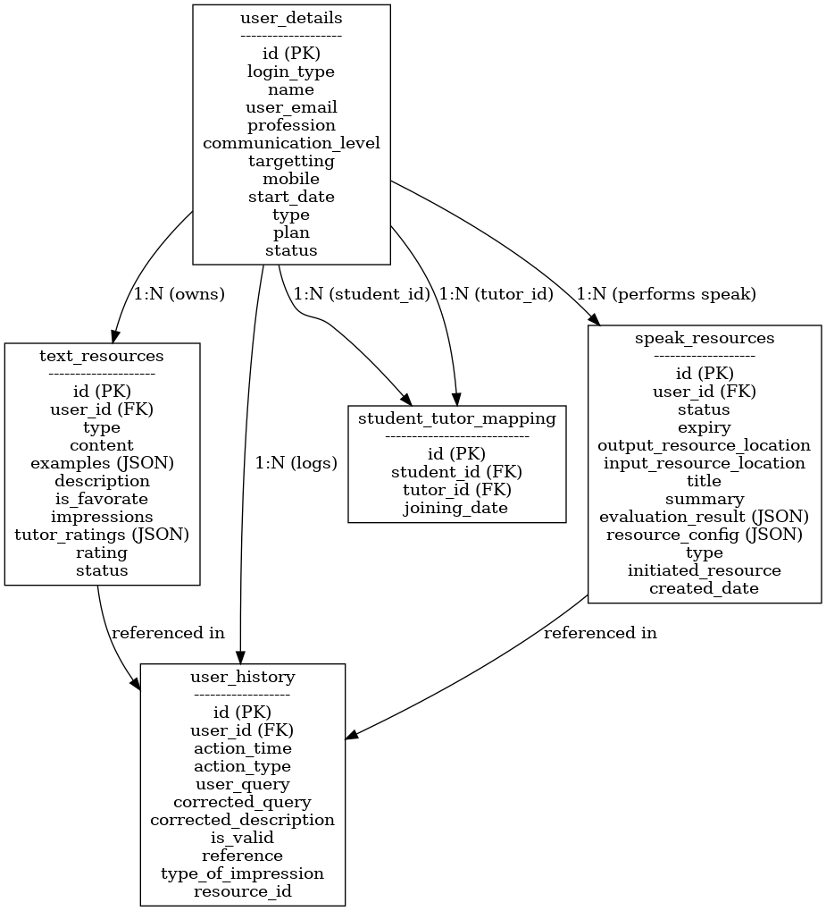

# Learn English – Technical Requirements

## 1. Overview
Learn English is a web-based platform for improving English communication.  
- **Frontend:** React  
- **Backend:** Python  
- **Purpose:** Vocabulary, phrases, grammar learning, and speaking practice  
- **Roles:** Student, Tutor, Admin  

---

## 2. Architecture
- **Frontend (React):** UI, Search, Speak functionality, History display, Tutor dashboard  
- **Backend (Python):** REST APIs, WebSocket for SpeakUp, NLP & Speech Processing  
- **Database:** PostgreSQL/MySQL  
- **External APIs:** Google OAuth, Instagram OAuth, Speech-to-Text, Text-to-Speech, NLP Engine  

---

## 3. UI Pages

### 3.1 Home Page
- Search bar for text queries → Calls **Process Text API**  
- Cards below search bar showing results (type, content, details) → Click opens popup with more details  
- Speak button beside search bar → Opens **Speak Page**  
- User menu (top-right): Logout, Assignments, History  

### 3.2 Speak Page
- Widget: **Start Speak** → User enters subject and time limit → Initiates Speak Session via WebSocket  
- List of Speak Resources (from `speak_resources` table)  
  - INITIATED (assignments) → Different color → Start speak session  
  - COMPLETED → View evaluation result  

---

## 4. Database Schema

### text_resources
```
id: uuid  
user_id: FK to user_details  
type: VOCABULARY | PHRASE | GRAMMAR  
content: string  
examples: json array  
description: string  
is_favorate: boolean  
impressions: int  
tutor_ratings: [{tutor_id, rating}]  
rating: int (0–5)  
status: ACTIVE | BLOCKED  
```

### user_details
```
id: uuid  
login_type: GOOGLE | FACEBOOK | INSTAGRAM  
name: string  
user_email: string  
profession: string  
communication_level: string  
targetting: string  
mobile: string  
start_date: datetime  
type: TUTOR | ADMIN | STUDENT  
plan: FREE | PREMIUM  
status: ACTIVE | BLOCKED  
```

### user_history
```
id: seq_id  
user_id: FK to user_details  
action_time: datetime  
action_type: text | speak  
user_query: string  
corrected_query: string  
corrected_description: string  
is_valid: boolean  
reference: FK to text_resources or speak_resources  
type_of_impression: NEW | EXISTING  
resource_id: uuid  
```

### student_tutor_mapping
```
id: uuid  
student_id: FK to user_details  
tutor_id: FK to user_details  
joining_date: date  
```

### speak_resources
```
id: uuid  
user_id: FK to user_details  
status: INITIATED | COMPLETED  
expiry: datetime  
output_resource_location: string  
input_resource_location: string  
title: string  
summary: string  
evaluation_result: json array of {criteria, reference_sentence, suggestion, examples}  
resource_config: json  
type: SUBJECT_SPEAK | CONVERSATION  
initiated_resource: TUTOR | STUDENT  
created_date: datetime  
```

---

## 5. API Endpoints

### Auth
```
POST /auth/google  
POST /auth/instagram  
```

### Search & Text Processing
```
GET /api/search?type=&order_by=&limit=&next_page_id=&target_user_id=  
POST /api/process-text – Processes user’s text query and returns details  
```

### SpeakUp (WebSocket)
```
WS /ws/speak  
- Start session (send subject & time limit)  
- Stop session (evaluation starts)  
```

### Tutor APIs
```
GET /api/tutor/students  
GET /api/tutor/student/{id}  
GET /api/tutor/recommendation/{user_id}  
```

---

## 6. Development Folder Structure

### Frontend (React)
```
/src  
  /components  
  /pages  
  /services (API calls)  
  /store (state management)  
  /assets  
  /utils  
```

### Backend (Python)
```
/app  
  /routes (API endpoints)  
  /services (business logic)  
  /models (DB schemas)  
  /config  
  /utils  
/tests  
```

---

## 7. System Workflow

1. **User Registration**  
   - Via Google/Instagram OAuth  
   - Ask improvement focus + current level  

2. **Search Flow**  
   - User enters query → Backend processes → NLP & DB lookup → Result cards returned  

3. **SpeakUp Flow**  
   - User starts speak session via WebSocket  
   - Records audio → Sends to backend → STT + NLP evaluation → TTS feedback  

4. **Tutor Portal**  
   - View assigned students  
   - Review their history & speak results  

---

## 8. Database Diagram


---

## 9. Non-Functional Requirements
- Responsive design  
- JWT authentication  
- Secure storage of OAuth tokens  
- Real-time WebSocket communication for speaking sessions  
- Pagination for history and search results 